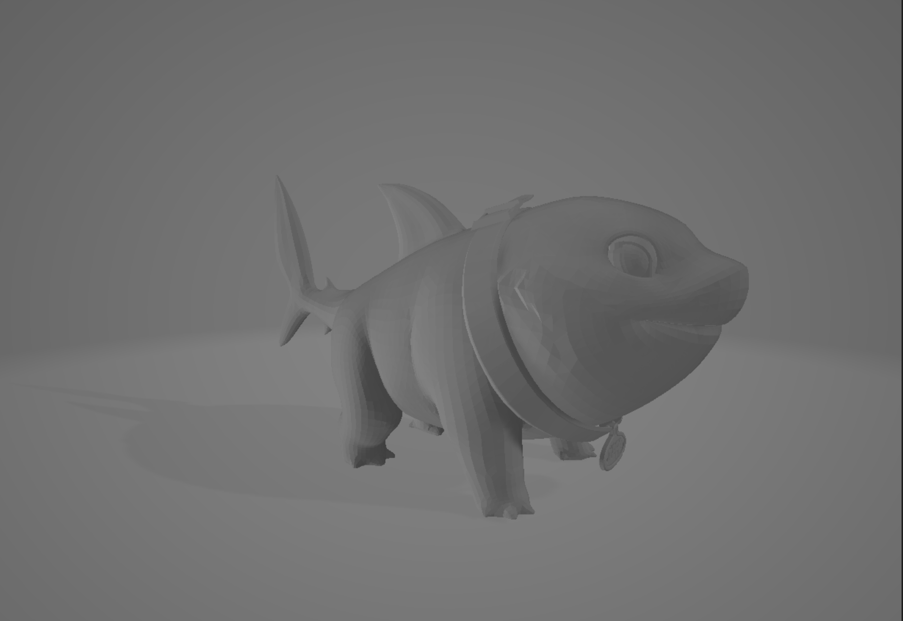
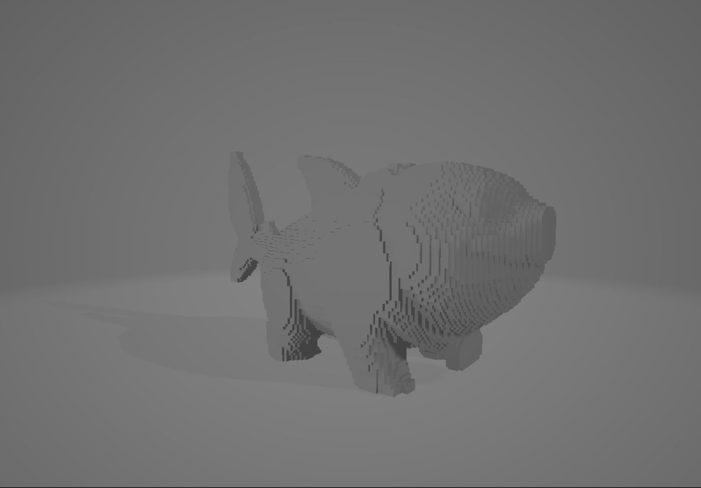
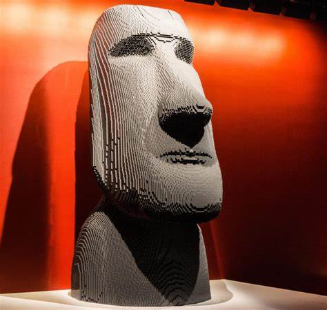

# STL to LEGO Converter

A Python application that converts 3D models (STL files) into buildable LEGO sculptures. The project currently supports converting 3D models into voxelized representations, with planned features to generate LEGO building instructions.

## Features

### Currently Implemented
- User-friendly GUI for file selection and conversion
- STL file loading and processing
- Advanced voxelization with optimized resolution
- Exports both `.npy` (NumPy array) and voxelized STL files
- Automatic resolution calculation based on model complexity
- Multi-threaded processing for responsive UI

### Planned Features
- LEGO brick mapping algorithm
- Generation of building instructions
- LDraw file export for compatibility with LEGO CAD software
- Optimization for structural stability
- Color matching for colored STL models

## How It Works

### 1. Voxelization Process

*Original 3D model input*


*The voxelization process converts a smooth 3D model into discrete cubic volumes*

The current implementation uses a sophisticated voxelization technique:

1. **Surface Sampling**: 
   - The 3D model's surface is sampled using an optimized grid
   - Sub-voxel sampling points ensure accurate surface representation
   - Adaptive resolution based on model complexity

2. **Volume Processing**:
   - Surface voxels are identified through triangle-point proximity tests
   - Internal volumes are filled using flood-fill algorithms
   - Floating voxels are removed for model integrity

3. **Optimization**:
   - Binary morphological operations smooth the result
   - Connected component analysis ensures model coherence
   - Memory-efficient batch processing for large models

### 2. Future LEGO Conversion


*Example of a LEGO sculpture*

The planned LEGO conversion will:

1. **Brick Mapping**:
   - Convert voxels into optimal LEGO brick combinations
   - Consider standard LEGO brick sizes (1x1, 2x2, 2x4, etc.)
   - Ensure structural stability through proper brick overlapping

2. **Structure Optimization**:
   - Analyze structural integrity
   - Optimize brick layout for stability
   - Add support structures where necessary

3. **Instruction Generation**:
   - Create layer-by-layer building instructions
   - Generate LDraw format files for LEGO CAD compatibility
   - Provide brick inventory and color matching

## Installation

```bash
# Clone the repository
git clone https://github.com/yourusername/stl-to-lego-converter.git

# Install dependencies
pip install -r requirements.txt
```

## Usage

1. Run the application:
```bash
python main.py
```

2. Use the GUI to:
   - Upload your STL file
   - Click "Convert to LEGO!" to process
   - Find output files in the same directory as input

## Output Files

The converter currently generates two files:
- `{model_name}.npy`: NumPy array of voxel data
- `{model_name}_voxelized.stl`: Voxelized 3D model for visualization

## Requirements

- Python 3.8+
- numpy
- scipy
- numpy-stl
- tkinter

## Contributing

Contributions are welcome! Please feel free to submit a Pull Request.
